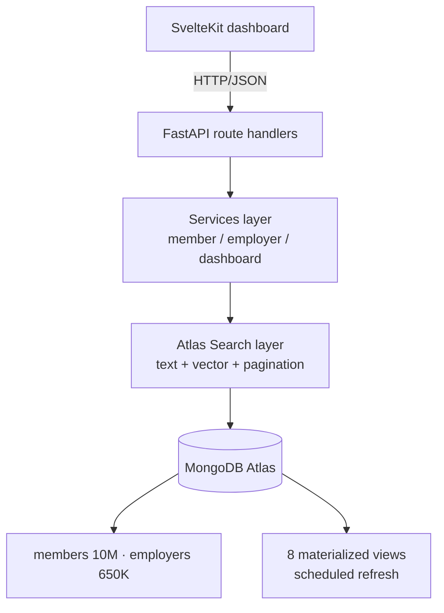

<!-- Portfolio repository -->

> **Pension Fund Officer Dashboard** — portfolio demonstration.
> Dual-mode Atlas Search + vector search at large member scale
>
> This is a sanitized public version of a real-world prototype. Client names,
> credentials, internal endpoints, and proprietary assets have been removed; all
> configuration is environment-driven (`.env.example`). Authored by
> [Paul Cleenewerck](https://github.com/pcleene).

---

# Pension Fund Officer Dashboard

> **Production-ready Officer Dashboard for a national pension fund**

A comprehensive internal administrative tool for PensionFund officers to monitor, search, and analyze member contributions and employer compliance data at scale.

## 📋 Table of Contents

- [Overview](#overview)
- [Architecture](#architecture)
- [Tech Stack](#tech-stack)
- [Project Structure](#project-structure)
- [Getting Started](#getting-started)
- [Database Setup](#database-setup)
- [Implementation Guide](#implementation-guide)
- [API Documentation](#api-documentation)
- [Frontend Development](#frontend-development)
- [Deployment](#deployment)

---

## 🎯 Overview

### Scale & Performance Requirements

- **Members:** 10 million active records
- **Employers:** 650,000 employer records
- **Transactions:** 1.2 million records per month (~14.4M/year)
- **Growth Rate:** 20% YoY
- **Target Performance:**
  - Search response time: < 500ms for text search
  - Vector search response time: < 1000ms
  - Dashboard load time: < 2 seconds

### Key Features

1. **Dual-Mode Search**
   - Full-text search with autocomplete
   - Natural language semantic search (vector search)
   - Advanced faceted filtering
   - Cursor-based pagination

2. **Real-time Dashboards**
   - Member demographics and statistics
   - Employer compliance monitoring
   - Contribution trend analysis
   - Balance distribution visualization

3. **Detailed Profiles**
   - Complete member profiles with contribution history
   - Employer profiles with submission tracking
   - Compliance and audit trails
   - Withdrawal and legal case tracking

---

## 🏗️ Architecture



### Layered Architecture Pattern (detail)

```
┌─────────────────────────────────────────────────┐
│                  Frontend (SvelteKit)            │
│  • Routes, Components, Stores, API Client       │
└────────────────────┬────────────────────────────┘
                     │ HTTP/JSON
┌────────────────────▼────────────────────────────┐
│              API Layer (FastAPI)                 │
│  • Route Handlers (HTTP requests/responses)     │
│  • Request validation                            │
└────────────────────┬────────────────────────────┘
                     │
┌────────────────────▼────────────────────────────┐
│            Services Layer                        │
│  • Business logic orchestration                  │
│  • Member/Employer/Dashboard services           │
└────────────────────┬────────────────────────────┘
                     │
┌────────────────────▼────────────────────────────┐
│         Search Layer (Atlas Search)              │
│  • Query builders                                │
│  • Vector search handlers                        │
│  • Pagination logic                              │
└────────────────────┬────────────────────────────┘
                     │
┌────────────────────▼────────────────────────────┐
│         Database (MongoDB Atlas)                 │
│  • Collections: members, employers               │
│  • Materialized Views (8 collections)           │
│  • Atlas Search Indexes (text + vector)         │
└─────────────────────────────────────────────────┘
```

### Data Architecture

**Collections:**
- `members` - 10M member documents with embedded contribution history
- `employers` - 650K employer documents with submission history
- `mv_member_demographics` - Materialized view (refreshed every 15-30 min)
- `mv_member_balances` - Materialized view (refreshed hourly)
- `mv_member_contribution_trends` - Materialized view (refreshed daily)
- `mv_member_compliance` - Materialized view (refreshed every 30 min)
- `mv_employer_profiles` - Materialized view (refreshed every 6 hours)
- `mv_employer_compliance` - Materialized view (refreshed every 3 hours)
- `mv_employer_workforce` - Materialized view (refreshed daily)
- `mv_employer_submissions` - Materialized view (refreshed daily)

---

## 🛠️ Tech Stack

### Backend
- **Python 3.11+**
- **FastAPI 0.109+** - Modern async web framework
- **Motor** - Async MongoDB driver
- **Pydantic v2** - Data validation and serialization
- **Anthropic Python SDK** - Voyage AI embeddings for vector search

### Frontend
- **Node.js 20+**
- **SvelteKit 2.0+** - Full-stack framework
- **Tailwind CSS 3.4+** - Utility-first styling
- **Chart.js** or **ApexCharts** - Data visualization

### Database
- **MongoDB Atlas** (M30+ cluster recommended)
- **Atlas Search** - Full-text search with faceting
- **Vector Search** - Semantic search with 512-dimensional embeddings
- **Atlas Triggers** - Scheduled materialized view refresh

### AI/ML
- **Anthropic Voyage Large 2** - 512-dimensional embeddings optimized for retrieval

---

## 📁 Project Structure

```
PensionFund_officer_dashboard/
├── backend/
│   ├── app/
│   │   ├── __init__.py
│   │   ├── main.py                    # FastAPI entry point
│   │   ├── config.py                  # Configuration settings
│   │   ├── database.py                # MongoDB connection
│   │   ├── api/
│   │   │   └── v1/
│   │   │       ├── router.py          # API router aggregator
│   │   │       └── routes/
│   │   │           ├── members.py     # Member endpoints
│   │   │           ├── employers.py   # Employer endpoints
│   │   │           ├── dashboard.py   # Dashboard endpoints
│   │   │           └── search.py      # Unified search
│   │   ├── models/
│   │   │   ├── __init__.py
│   │   │   ├── members.py             # Member Pydantic models
│   │   │   ├── employers.py           # Employer Pydantic models
│   │   │   ├── search.py              # Search models
│   │   │   └── dashboard.py           # Dashboard models
│   │   ├── services/
│   │   │   ├── __init__.py
│   │   │   ├── member_service.py      # Member business logic
│   │   │   ├── employer_service.py    # Employer business logic
│   │   │   └── dashboard_service.py   # Dashboard logic
│   │   ├── search/                     # TO BE IMPLEMENTED
│   │   │   ├── __init__.py
│   │   │   ├── query_builder.py       # Atlas Search query builder
│   │   │   ├── vector_search.py       # Vector search handler
│   │   │   └── pagination.py          # Pagination utilities
│   │   └── utils/                      # TO BE IMPLEMENTED
│   │       ├── __init__.py
│   │       ├── filters.py             # Filter builders
│   │       └── validators.py          # Custom validators
│   ├── atlas_search_indexes/          # Atlas Search index configs
│   │   ├── members_search_index.json
│   │   ├── members_vector_index.json
│   │   ├── employers_search_index.json
│   │   └── employers_vector_index.json
│   ├── tests/                          # TO BE IMPLEMENTED
│   ├── requirements.txt
│   └── .env.example
│
├── frontend/                           # TO BE IMPLEMENTED
│   ├── src/
│   │   ├── routes/
│   │   │   ├── +layout.svelte
│   │   │   ├── +page.svelte
│   │   │   ├── members/
│   │   │   │   ├── +page.svelte
│   │   │   │   └── [memberId]/+page.svelte
│   │   │   └── employers/
│   │   │       ├── +page.svelte
│   │   │       └── [employerId]/+page.svelte
│   │   └── lib/
│   │       ├── components/
│   │       ├── stores/
│   │       ├── api/
│   │       └── utils/
│   ├── package.json
│   └── README.md
│
└── README.md                           # This file
```

---

## 🚀 Getting Started

### Prerequisites

- Python 3.11+
- Node.js 20+
- MongoDB Atlas account (M30+ cluster recommended)
- Anthropic API key (for Voyage AI embeddings)

### Backend Setup

1. **Clone the repository:**

```bash
git clone <repository-url>
cd PensionFund_officer_dashboard
```

2. **Create virtual environment:**

```bash
cd backend
python -m venv venv
source venv/bin/activate  # On Windows: venv\Scripts\activate
```

3. **Install dependencies:**

```bash
pip install -r requirements.txt
```

4. **Configure environment:**

```bash
cp .env.example .env
# Edit .env with your MongoDB Atlas URL and Anthropic API key
```

5. **Run the application:**

```bash
python -m app.main
# Or use uvicorn directly:
uvicorn app.main:app --reload
```

6. **Access the API:**

- API Docs: http://localhost:8000/api/docs
- Health Check: http://localhost:8000/health

---

## 🗄️ Database Setup

### 1. Create MongoDB Atlas Cluster

1. Sign up at [MongoDB Atlas](https://www.mongodb.com/cloud/atlas)
2. Create a new cluster (M30+ recommended for production)
3. Create a database user and get your connection string
4. Add your IP address to the IP whitelist

### 2. Create Database and Collections

```javascript
// In MongoDB Atlas UI or MongoDB Compass

// Create database
use PensionFund_db

// Create main collections
db.createCollection("members")
db.createCollection("employers")

// Create materialized view collections
db.createCollection("mv_member_demographics")
db.createCollection("mv_member_balances")
db.createCollection("mv_member_contribution_trends")
db.createCollection("mv_member_compliance")
db.createCollection("mv_employer_profiles")
db.createCollection("mv_employer_compliance")
db.createCollection("mv_employer_workforce")
db.createCollection("mv_employer_submissions")
```

### 3. Create Atlas Search Indexes

Use the provided JSON configurations in `backend/atlas_search_indexes/`:

**In MongoDB Atlas UI:**

1. Go to your cluster
2. Click "Search" tab
3. Click "Create Search Index"
4. Select "JSON Editor"
5. Paste the contents of each JSON file:
   - `members_search_index.json` → members collection
   - `members_vector_index.json` → members collection
   - `employers_search_index.json` → employers collection
   - `employers_vector_index.json` → employers collection

### 4. Create Standard Indexes

```javascript
// Members collection indexes
db.members.createIndex({ "memberId": 1 }, { unique: true })
db.members.createIndex({ "personalInfo.fullName": 1 })
db.members.createIndex({ "employmentProfile.currentEmployer.employerId": 1 })
db.members.createIndex({ "accountInfo.accountStatus": 1 })
db.members.createIndex({ "complianceFlags.riskScore": 1 })
db.members.createIndex({ "metadata.updatedAt": -1 })

// Employers collection indexes
db.employers.createIndex({ "employerId": 1 }, { unique: true })
db.employers.createIndex({ "employerCode": 1 }, { unique: true })
db.employers.createIndex({ "companyProfile.companyName": 1 })
db.employers.createIndex({ "companyProfile.industryClassification.sector": 1 })
db.employers.createIndex({ "accountStatus.status": 1 })
db.employers.createIndex({ "complianceStatus.riskRating": 1 })
db.employers.createIndex({ "metadata.updatedAt": -1 })
```

---

## 📖 Implementation Guide

### Critical Components TO BE IMPLEMENTED

#### 1. **Search Query Builder** (`backend/app/search/query_builder.py`)

Create Atlas Search compound queries with proper filter handling:

```python
def build_compound_operator(search_text, filters):
    """
    Build Atlas Search compound operator.

    Returns compound operator with:
    - must: text search queries
    - filter: facet filters
    - should: boosting queries
    """
    pass
```

**Key Requirements:**
- Support text search with autocomplete
- Handle multi-select filters (use `in` operator)
- Support range filters for numbers
- Implement proper score boosting

#### 2. **Pagination Utilities** (`backend/app/search/pagination.py`)

Implement cursor-based pagination using `searchSequenceToken`:

```python
async def paginate_search_results(
    collection,
    search_cmd,
    limit,
    cursor=None,
    direction="next"
):
    """
    Execute paginated Atlas Search query.

    Returns:
    - results: List of documents
    - pagination: PaginationInfo object
    - facets: List of facets (if requested)
    """
    pass
```

**Critical Points:**
- ALWAYS include `_id` in sort spec for deterministic ordering
- Use `searchAfter` for "next" pagination
- Use `searchBefore` for "previous" pagination
- Fetch `limit + 1` to determine if more results exist
- Add `searchSequenceToken` to results BEFORE `$limit` stage

#### 3. **Vector Search Handler** (`backend/app/search/vector_search.py`)

Implement semantic search with Anthropic Voyage AI:

```python
from anthropic import Anthropic

client = Anthropic(api_key=settings.anthropic_api_key)

def generate_embedding(text: str) -> List[float]:
    """Generate 512-dimensional embedding using Voyage Large 2."""
    response = client.embeddings.create(
        model="voyage-large-2",
        input=text
    )
    return response.embeddings[0]

async def vector_search(
    collection,
    query_text: str,
    filters: dict,
    limit: int,
    num_candidates: int
):
    """
    Perform vector search.

    Steps:
    1. Generate query embedding
    2. Execute $vectorSearch pipeline
    3. Apply post-search filters
    4. Return scored results
    """
    pass
```

#### 4. **Materialized View Pipelines** (`backend/app/search/materialized_views.py`)

Implement aggregation pipelines for each materialized view:

**Example: Member Demographics**

```python
async def refresh_member_demographics(db):
    """
    Refresh mv_member_demographics materialized view.

    Pipeline uses $facet to create multiple aggregations,
    then $merge to update the materialized view collection.
    """
    pipeline = [
        {
            "$facet": {
                "totalMembers": [{"$count": "count"}],
                "byGender": [
                    {"$group": {"_id": "$personalInfo.gender", "count": {"$sum": 1}}},
                    {"$sort": {"count": -1}}
                ],
                # ... other facets
            }
        },
        {
            "$addFields": {
                "_id": "demographics_summary",
                "viewType": "demographics",
                "refreshedAt": "$$NOW",
                "dataSource": "members"
            }
        },
        {
            "$merge": {
                "into": "mv_member_demographics",
                "on": "_id",
                "whenMatched": "replace",
                "whenNotMatched": "insert"
            }
        }
    ]

    await db.members.aggregate(pipeline).to_list(None)
```

**Create similar pipelines for all 8 materialized views.**

#### 5. **Atlas Triggers for Auto-Refresh**

Set up scheduled triggers in MongoDB Atlas:

1. Go to Atlas → App Services → Triggers
2. Create a new scheduled trigger for each view
3. Set cron schedule (e.g., `*/15 * * * *` for every 15 minutes)
4. Add the aggregation pipeline code

**Example Trigger Function:**

```javascript
exports = async function() {
  const mongodb = context.services.get("mongodb-atlas");
  const db = mongodb.db("PensionFund_db");

  await db.collection("members").aggregate([
    // ... pipeline from above
  ]).toArray();

  console.log("Member demographics refreshed at:", new Date());
};
```

#### 6. **Facet Parser** (`backend/app/utils/filters.py`)

Parse Atlas Search facet results into UI-friendly format:

```python
def parse_facets(facet_data: dict) -> List[Facet]:
    """
    Convert Atlas Search facet results to Pydantic models.

    Input: Raw facet data from $$SEARCH_META
    Output: List[Facet] for frontend consumption
    """
    pass
```

---

## 📚 API Documentation

### Members Endpoints

```
GET  /api/v1/members/search              # Full-text search with facets
POST /api/v1/members/search/vector       # Natural language search
GET  /api/v1/members/{memberId}          # Get member details
GET  /api/v1/members/{memberId}/contributions
GET  /api/v1/members/{memberId}/employers
GET  /api/v1/members/{memberId}/withdrawals
```

### Employers Endpoints

```
GET  /api/v1/employers/search            # Full-text search with facets
POST /api/v1/employers/search/vector     # Natural language search
GET  /api/v1/employers/{employerId}      # Get employer details
GET  /api/v1/employers/{employerId}/submissions
GET  /api/v1/employers/{employerId}/members
GET  /api/v1/employers/{employerId}/compliance
```

### Dashboard Endpoints

```
GET  /api/v1/dashboard/members/stats                  # All member stats
GET  /api/v1/dashboard/members/demographics          # Demographics only
GET  /api/v1/dashboard/members/balances              # Balances only
GET  /api/v1/dashboard/members/contribution-trends   # Trends only
GET  /api/v1/dashboard/members/compliance            # Compliance only

GET  /api/v1/dashboard/employers/stats               # All employer stats
GET  /api/v1/dashboard/employers/profiles            # Profiles only
GET  /api/v1/dashboard/employers/compliance          # Compliance only
GET  /api/v1/dashboard/employers/workforce           # Workforce only
GET  /api/v1/dashboard/employers/submission-trends   # Trends only

POST /api/v1/dashboard/refresh                       # Manual refresh
```

### Interactive API Documentation

Once the server is running, visit:
- **Swagger UI:** http://localhost:8000/api/docs
- **ReDoc:** http://localhost:8000/api/redoc

---

## 🎨 Frontend Development

### TO BE IMPLEMENTED

The frontend skeleton has been created in `frontend/` but needs implementation:

### 1. Initialize SvelteKit Project

```bash
cd frontend
npm create svelte@latest .
# Choose: Skeleton project, TypeScript: Yes, ESLint: Yes, Prettier: Yes
npm install
```

### 2. Install Dependencies

```bash
npm install -D tailwindcss postcss autoprefixer
npm install axios chart.js
```

### 3. Configure Tailwind CSS

```bash
npx tailwindcss init -p
```

### 4. Create Components

**Priority Components:**
- `SearchBar.svelte` - Dual-mode search input
- `DataTable.svelte` - Results table with pagination
- `SummaryCard.svelte` - Dashboard stat cards
- `FacetPanel.svelte` - Left sidebar filters
- `Chart.svelte` - Wrapper for Chart.js
- `Badge.svelte` - Status badges

### 5. Implement Pages

1. **Members Dashboard** (`frontend/src/routes/members/+page.svelte`)
2. **Member Detail** (`frontend/src/routes/members/[memberId]/+page.svelte`)
3. **Employers Dashboard** (`frontend/src/routes/employers/+page.svelte`)
4. **Employer Detail** (`frontend/src/routes/employers/[employerId]/+page.svelte`)

### Color Scheme

Use these colors to match PensionFund branding:

```css
/* tailwind.config.js */
module.exports = {
  theme: {
    extend: {
      colors: {
        'navy': '#1E3A8A',
        'sky': '#0EA5E9',
        'gold': '#F59E0B',
      }
    }
  }
}
```

---

## 🧪 Testing

### TO BE IMPLEMENTED

Create tests in `backend/tests/`:

```bash
pytest backend/tests/
```

**Test Coverage:**
- Unit tests for services
- Integration tests for API endpoints
- Search query validation tests
- Pagination tests

---

## 🚢 Deployment

### Backend Deployment (Railway/Render)

1. Create `Dockerfile`:

```dockerfile
FROM python:3.11-slim

WORKDIR /app

COPY backend/requirements.txt .
RUN pip install --no-cache-dir -r requirements.txt

COPY backend/app ./app

CMD ["uvicorn", "app.main:app", "--host", "0.0.0.0", "--port", "8000"]
```

2. Deploy to Railway or Render with environment variables from `.env.example`

### Frontend Deployment (Vercel)

```bash
cd frontend
npm run build
# Deploy to Vercel
vercel
```

---

## 📊 Monitoring & Observability

### Recommended Tools

- **Application Monitoring:** New Relic, Datadog
- **Database Monitoring:** MongoDB Atlas built-in monitoring
- **Logging:** CloudWatch, Logtail
- **Error Tracking:** Sentry

---

## 🤝 Contributing

This is an internal PensionFund Malaysia project. Please follow these guidelines:

1. Create feature branches from `main`
2. Write tests for new features
3. Update documentation
4. Submit PR for code review

---

## 📝 License

Proprietary - PensionFund Malaysia Internal Use Only

---

## 📞 Support

For questions or issues:
- Create an issue in this repository
- Contact the PensionFund IT team
- Email: support@PensionFund.com.my

---

## ✅ Implementation Checklist

### Phase 1: Core Infrastructure ✅
- [x] Project structure setup
- [x] FastAPI application with routes
- [x] Pydantic models
- [x] Database connection
- [x] Atlas Search index configs
- [x] Service layer stubs

### Phase 2: Search & Pagination ⏳
- [ ] Implement query_builder.py
- [ ] Implement pagination.py
- [ ] Implement vector_search.py
- [ ] Implement facet parsing
- [ ] Test search with sample data

### Phase 3: Materialized Views ⏳
- [ ] Create 8 aggregation pipelines
- [ ] Set up Atlas Triggers
- [ ] Test view refresh
- [ ] Implement manual refresh endpoint

### Phase 4: Frontend ⏳
- [ ] Initialize SvelteKit project
- [ ] Create UI components
- [ ] Implement member dashboard
- [ ] Implement employer dashboard
- [ ] Implement detail pages

### Phase 5: Integration & Testing ⏳
- [ ] End-to-end testing
- [ ] Performance optimization
- [ ] Security review
- [ ] Documentation review

### Phase 6: Deployment ⏳
- [ ] Set up production MongoDB cluster
- [ ] Deploy backend
- [ ] Deploy frontend
- [ ] Configure monitoring
- [ ] User acceptance testing

---

**Built with ❤️ for PensionFund Malaysia**
